# 최종 보고서: 2016~2026 KOSIS 고용 데이터 기반 지역 고용격차 분석

## 1. 분석 목적

이 보고서는 KOSIS 고용 raw 데이터를 이용해 지역 간 고용 여건 차이를 정석적인 EDA 파이프라인으로 점검하고, 고용 측면에서 지역 간 삶의 질 격차를 줄이는 데 어떤 정책 레버가 가장 우선적인지 도출한다.

삶의 만족도 원자료를 직접 결합한 인과분석은 아니므로, 결론은 정책 효과의 확정 추정치가 아니라 고용 구조 데이터가 가리키는 우선 개입 방향으로 해석한다.

## 2. 원본 데이터 EDA

- 출처: KOSIS 고용 관련 시도별 분기 통계
- 완전 연도 분석 기간: `2016~2025`
- 최신 참고값: `2026년 1분기`는 부분연도이므로 정책 결론 산정에서는 제외
- 분석 단위: `year × region`, 17개 시도

먼저 원본 데이터가 분석 가능한 상태인지 확인했다. EDA에서는 각 raw CSV의 행·열 수, 결측치, 중복행, 기간 coverage, 지역 coverage, 항목 수를 점검했다.

| 원본 데이터 | 행 | 열 | 결측률 | 중복행 | 기간 | 고유 분기 수 | 지역 수 | 항목 수 |
|---|---:|---:|---:|---:|---|---:|---:|---:|
| 성별 경제활동인구 총괄 | 54 | 289 | 0.00% | 0 | 2016.1/4~2026.1/4 | 41 | 17 | 7 |
| 교육정도별 취업자 | 126 | 43 | 0.00% | 0 | 2016.1/4~2026.1/4 | 41 | 17 | 7 |
| 취업시간별 취업자 | 252 | 43 | 0.00% | 0 | 2016.1/4~2026.1/4 | 41 | 17 | 14 |
| 연령별 취업자 | 180 | 43 | 0.00% | 0 | 2016.1/4~2026.1/4 | 41 | 17 | 10 |
| 성·연령별 취업자 | 540 | 47 | 2.62% | 0 | 2016.1/4~2026.1/4 | 41 | 17 | 3 |
| 종사상지위별 취업자 | 180 | 43 | 0.00% | 0 | 2016.1/4~2026.1/4 | 41 | 17 | 10 |

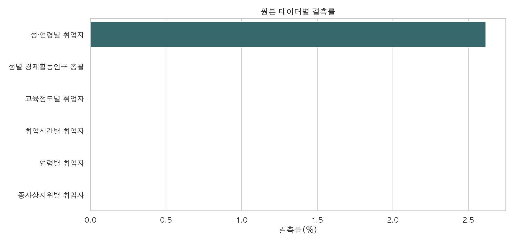

결측률을 먼저 확인한 이유는 특정 지표의 결측이 크면 지역 간 차이가 실제 차이가 아니라 데이터 공백에서 나올 수 있기 때문이다. 현재 핵심 raw 데이터는 결측률이 분석을 막을 수준으로 나타나지 않았다.

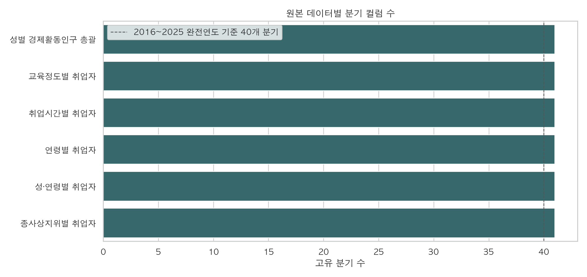

분기 coverage를 확인한 결과 2016.1/4~2026.1/4 자료가 들어왔고, 2016~2025년은 완전 연도 기준 40개 분기로 구성된다. 2026년은 1분기만 있으므로 최종 정책 결론에서는 제외했다.

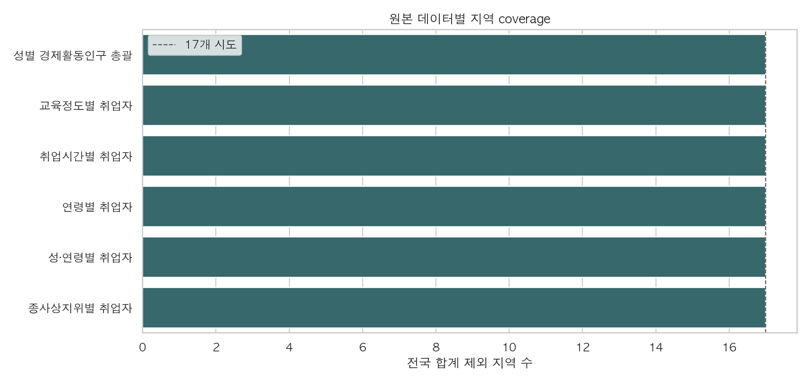

지역 coverage는 전국 합계를 제외한 17개 시도 기준으로 확인했다. 지역 수가 맞아야 수도권/비수도권 비교와 시도별 순위가 왜곡되지 않는다.

## 3. 원본 데이터별 사용 근거

이번 분석은 아무 고용지표나 임의로 묶은 것이 아니라, 원본 데이터가 삶의 질 proxy에서 어떤 의미를 갖는지 먼저 정했다. 아래 기준에 따라 각 raw 파일을 분석에 사용했다.

| 원본 데이터 | 주요 변수 | 분석에서의 역할 | 삶의 질과 연결한 근거 |
|---|---|---|---|
| 성별 경제활동인구 총괄 | 고용률, 15~64세 고용률, 실업률, 경제활동참가율, 여성 고용률, 성별 고용률 격차 | 지역 노동시장의 핵심 성과와 포용성 판단 | 일할 기회, 소득 가능성, 경제활동 참여 기반은 지역 삶의 질의 기본 조건이다. |
| 교육정도별 취업자 | 대졸이상 취업자 비중 | 고학력 인력이 일할 수 있는 지역 산업·직무 기반 판단 | 지역 안에 전문직무와 성장 가능한 커리어가 있어야 청년·고학력 인력이 정착한다. |
| 취업시간별 취업자 | 단시간 취업자 비중, 장시간 취업자 비중, 평균 취업시간 | 근로시간 안정성과 불완전취업 가능성 판단 | 과소·과잉 근로는 소득 안정성과 일-생활 균형을 모두 흔들 수 있다. |
| 연령별 취업자 | 청년층 취업자 비중, 고령층 취업자 비중 | 청년 정착 가능성과 지역 노동시장 고령화 확인 | 청년이 일자리를 찾고 머물 수 있는 지역일수록 장기적 생활 기반이 안정적이다. |
| 성·연령별 취업자 | 성별·연령별 취업자 구조 | 성별과 연령을 동시에 고려한 보조 진단 | 특정 성·연령 집단에 일자리 기회가 쏠리거나 배제되는지 확인한다. |
| 종사상지위별 취업자 | 임금근로자, 상용근로자, 임시근로자, 일용근로자, 자영업자 비중 | 고용 안정성과 일자리 질 판단 | 상용·임금 일자리는 소득 안정, 사회보험, 미래 계획 가능성과 연결된다. |

## 4. 내가 세운 고용-삶의 질 proxy 기준

삶의 만족도 원자료가 아직 없기 때문에, 이번 분석에서는 `고용이 삶의 질에 영향을 줄 수 있는 경로`를 직접 정의했다. 기준은 여섯 가지다. 단순히 고용률이 높은 지역을 좋은 지역으로 보지 않고, 일자리 접근성, 포용성, 안정성, 청년 정착성, 근로시간, 지역 산업 기반을 함께 봤다.

| 자체 분석 기준 | 사용 feature | 방향성 | 삶의 질과 연결한 가정 | 정책 해석 |
|---|---|---|---|---|
| 기초 고용 접근성 | 고용률, 15~64세 고용률, 경제활동참가율, 실업률 | 고용률·참가율은 높을수록, 실업률은 낮을수록 좋음 | 지역 주민이 일할 기회와 소득 기반에 접근할 수 있어야 삶의 질이 안정된다. | 구직 매칭, 직업훈련, 이동·주거 지원, 지역 일자리 흡수력 강화 |
| 여성 고용 참여 | 여성 고용률, 여성 경제활동참가율, 남녀 고용률 격차 | 여성 고용률·참가율은 높을수록, 성별 격차는 낮을수록 좋음 | 여성의 노동시장 참여는 가구소득, 돌봄 부담 완화, 지역 포용성과 연결된다. | 돌봄 인프라, 경력단절 복귀, 유연근무, 여성 일자리 질 관리 |
| 안정적 임금일자리 | 임금근로자 비중, 상용근로자 비중, 임시·일용근로자 비중, 자영업자 비중 | 상용·임금근로는 높을수록, 임시·일용·자영업 의존은 낮을수록 안정적이라고 봄 | 안정적 임금일자리는 소득 예측 가능성, 사회보험, 주거·가계 계획 가능성과 연결된다. | 상용직 채용 인센티브, 사회보험 조건부 지원, 중소기업 임금·복지 격차 완화 |
| 청년 정착 일자리 | 청년층 취업자 비중, 고령층 취업자 비중 | 청년층 비중은 높을수록, 고령층 과다 의존은 낮을수록 청년 정착 여건이 좋다고 봄 | 청년이 지역에서 첫 직장과 경력 경로를 찾을 수 있어야 지역의 장기 활력이 유지된다. | 지역 대학-기업 연결, 청년 주거·생활 지원, 신산업·공공서비스 일자리 |
| 근로시간 안정성 | 단시간 취업자 비중, 장시간 취업자 비중 | 단시간·장시간 비중은 낮을수록 안정적이라고 봄 | 비자발적 단시간은 소득 불안, 장시간은 일-생활 균형 저하와 연결될 수 있다. | 비자발적 단시간 근로 완화, 시간제 사회보험 사각지대 축소, 근로시간 선택권 |
| 고학력·지역산업 일자리 기반 | 대졸이상 취업자 비중 | 높을수록 지역 안에 전문직무와 성장 가능한 일자리 기반이 있다고 봄 | 고학력 인력이 지역에 남을 수 있는 산업·직무가 있어야 청년 유출과 지역 격차를 줄일 수 있다. | 전문직무 창출, 지역 전략산업, R&D·디지털 전환, 지역 중견기업 성장 |

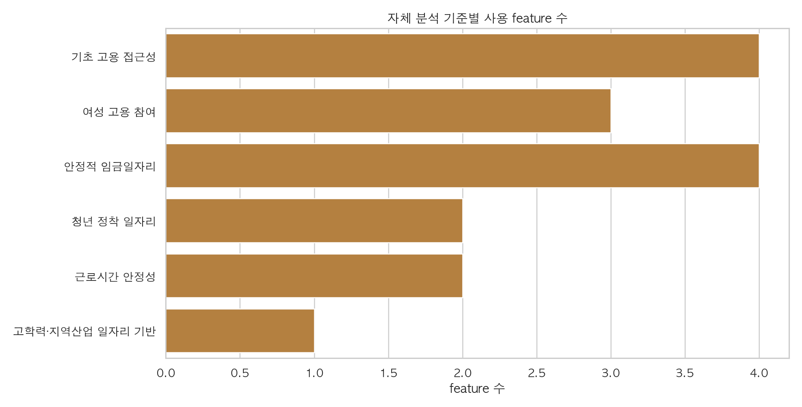

이 기준을 세운 이유는 지역 간 삶의 질 격차가 단순한 취업자 수 차이가 아니라, 어떤 사람이 어떤 질의 일자리에 접근할 수 있는지에서 발생한다고 보았기 때문이다.

## 5. 분석 파이프라인

```text
KOSIS raw CSV
  -> 원본 데이터별 결측치·중복·기간·지역 coverage 진단
  -> 원본 파일 보관 및 안정 파일명 정리
  -> 분기 컬럼 long 변환
  -> 지역명 17개 시도 기준 정규화
  -> 수도권/비수도권 분류
  -> 분기 패널 생성
  -> 완전 연도 기준 연평균 패널 생성
  -> 고용 접근성, 여성 고용, 안정일자리, 청년정착, 근로시간 점수화
  -> 지역별 격차와 정책 우선순위 산정
```

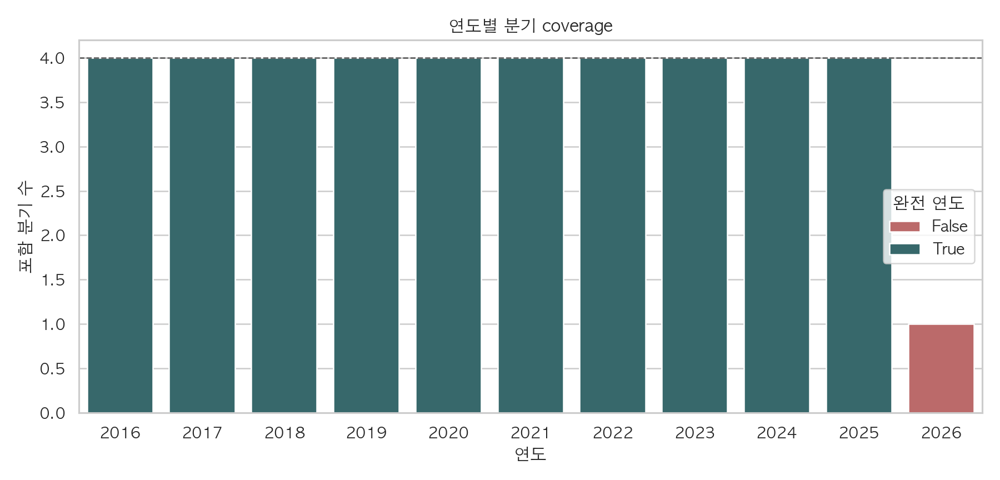

위 그래프는 2016~2025년은 4개 분기가 모두 있는 완전 연도이고, 2026년은 1분기만 있는 부분연도임을 보여준다. 따라서 정책 결론은 2016~2025년 완전 연도 기준으로 냈다.

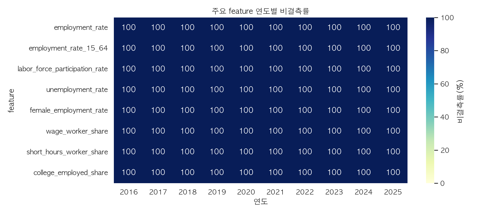

주요 고용 feature는 2016~2025년 대부분의 지역·연도에서 결측 없이 구성되어, 장기 EDA와 지역 비교에 사용할 수 있다.

## 6. 핵심 EDA 결과

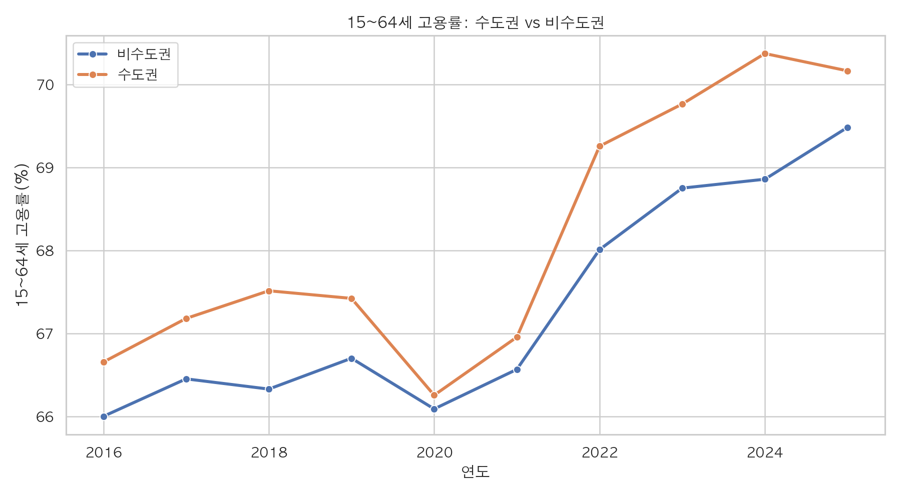

15~64세 고용률은 지역 노동시장의 핵심 결과 지표로 사용했다. 수도권과 비수도권 평균 차이뿐 아니라 연도별 변화를 함께 확인했다.

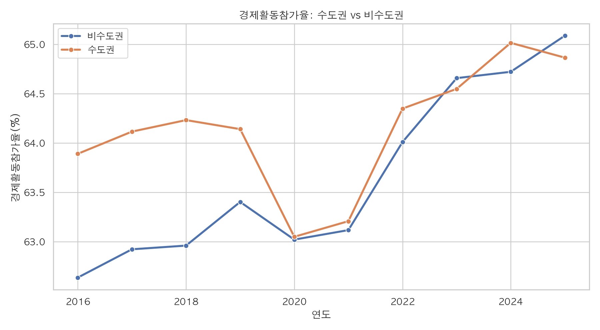

경제활동참가율은 지역 주민이 실제 노동시장에 진입하는 정도를 보여준다. 고용률이 낮은 지역은 단순히 일자리 수만이 아니라 노동시장 참여 기반도 함께 봐야 한다.

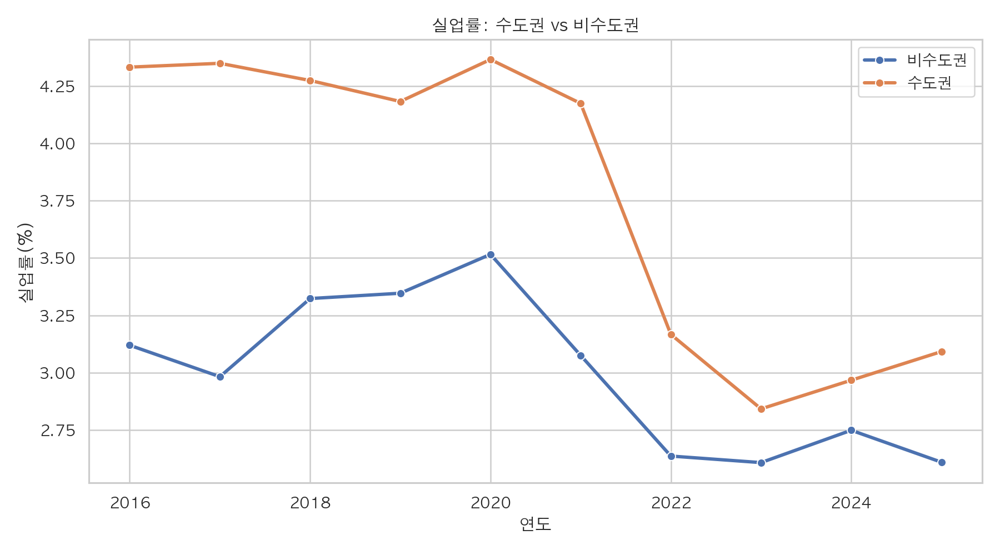

실업률은 경기 변동과 지역별 일자리 흡수력을 함께 반영한다. 단, 실업률만 보면 비경제활동인구 증가 문제를 놓칠 수 있어 고용률·참가율과 같이 해석했다.

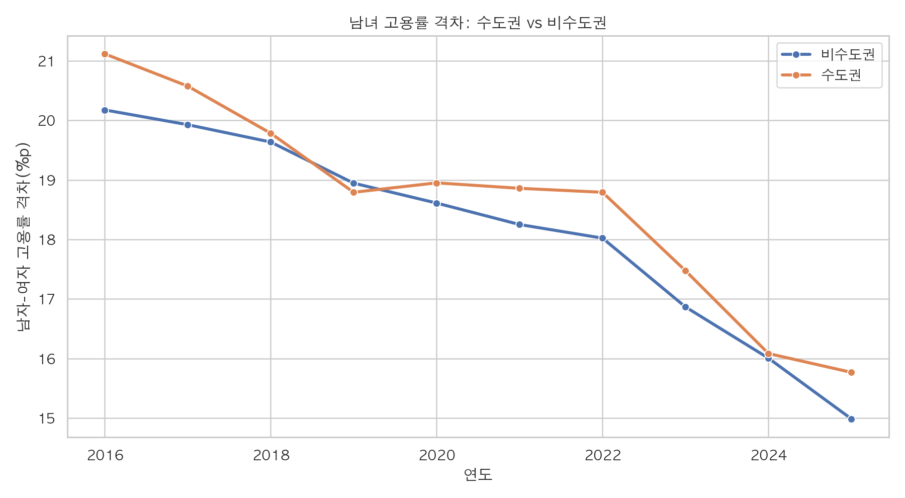

성별 고용률 격차는 지역의 돌봄, 산업구조, 일자리 유연성 차이를 반영할 수 있다. 이 지표는 지역 간 삶의 질 격차와 연결될 가능성이 큰 포용성 지표로 사용했다.

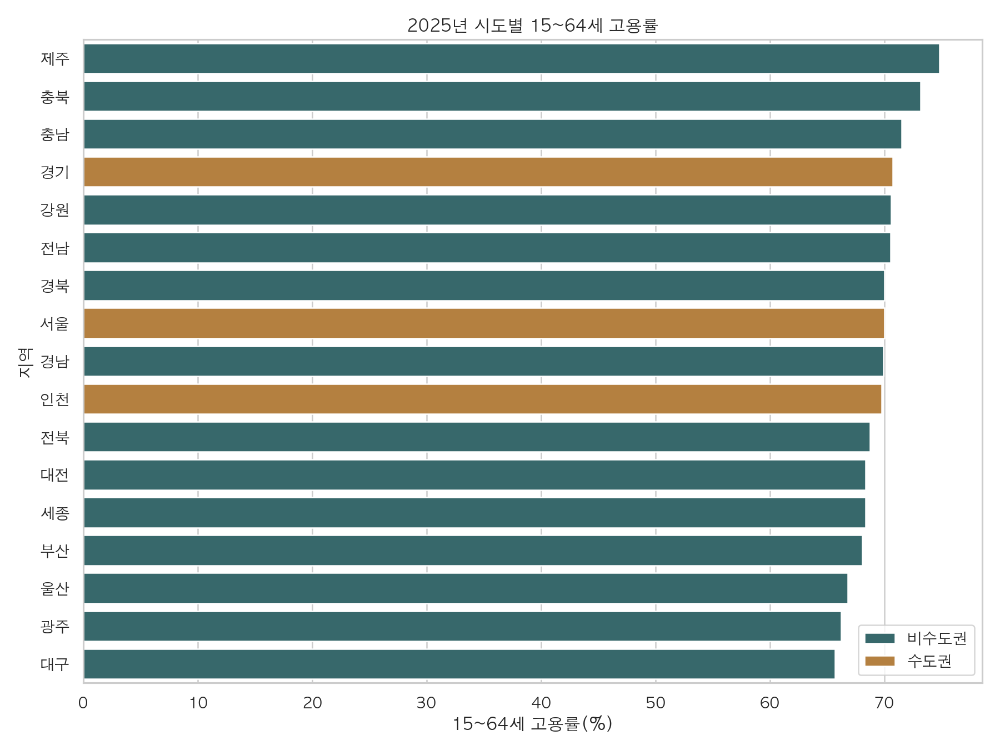

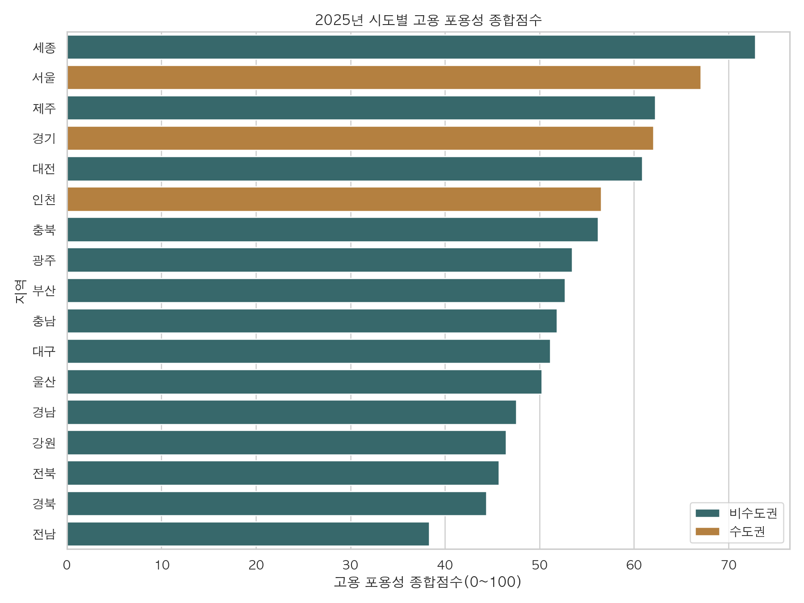

2025년 기준 지역별 고용 여건은 단일 지표가 아니라 고용률, 여성 고용, 안정일자리, 근로시간, 청년·고령 구조가 결합된 결과로 차이가 나타난다.

## 7. 정책 우선순위 결론

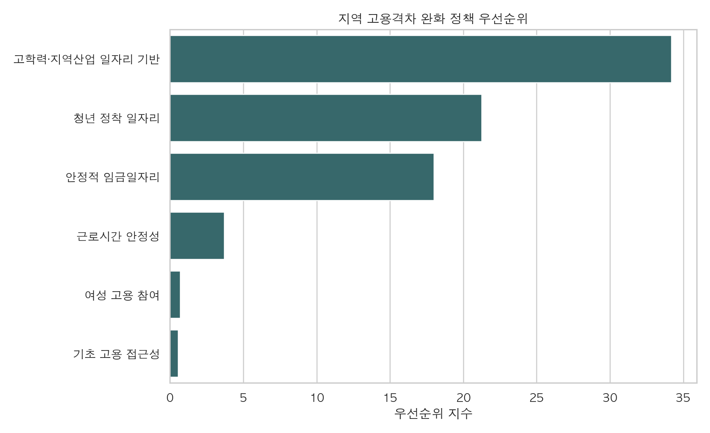

데이터 기준 최우선 정책 레버는 **고학력·지역산업 일자리 기반**이다. 이 레버는 고용 포용성 상위 지역과 하위 지역 사이의 격차가 크고, 종합 고용 여건 점수와의 관련성도 높게 나타났다.

두 번째 우선순위는 **청년 정착 일자리**, 세 번째 우선순위는 **안정적 임금일자리**이다. 따라서 정책 설계는 1순위 레버만 단독으로 추진하기보다, `고학력·지역산업 일자리 기반 + 청년 정착 일자리 + 안정적 임금일자리` 조합으로 설계하는 것이 타당하다.

여기서 고학력·지역산업 일자리 기반은 교육정책만을 뜻하지 않는다. 원자료상 `대졸이상 취업자 비중`을 사용한 구조지표이며, 지역 안에 대졸 이상 인력이 머물 수 있는 산업, 직무, 임금근로 일자리가 얼마나 있는지를 보는 proxy다.

정책 우선순위 산정 기준은 다음과 같다.

- 2025년 기준 고용 포용성 상위 5개 지역과 하위 5개 지역의 레버 점수 격차
- 2016~2025년 동안 반복적으로 유지된 평균 격차
- 해당 레버 점수와 종합 고용 포용성 점수의 상관

| 순위 | 정책 레버 | 2025년 상하위 격차 | 10년 평균 격차 | 종합점수 상관 | 우선순위 지수 |
|---:|---|---:|---:|---:|---:|
| 1 | 고학력·지역산업 일자리 기반 | 41.6 | 38.6 | 0.85 | 34.2 |
| 2 | 청년 정착 일자리 | 41.0 | 40.7 | 0.52 | 21.3 |
| 3 | 안정적 임금일자리 | 27.3 | 24.0 | 0.70 | 18.0 |
| 4 | 근로시간 안정성 | 10.6 | 7.9 | 0.40 | 3.7 |
| 5 | 여성 고용 참여 | 2.2 | 4.0 | 0.23 | 0.7 |

중요한 점은 단순 고용률만으로는 지역 불평등을 충분히 설명하기 어렵다는 것이다. 2025년 평균 15~64세 고용률은 수도권 70.2%, 비수도권 69.5%로 큰 차이가 아니었다. 반면 고용 포용성 종합점수는 수도권 61.9, 비수도권 52.4로 더 크게 벌어진다. 즉 격차의 핵심은 일자리 수보다 지역 안에 어떤 질의 일자리와 커리어 경로가 있는지에 가깝다.

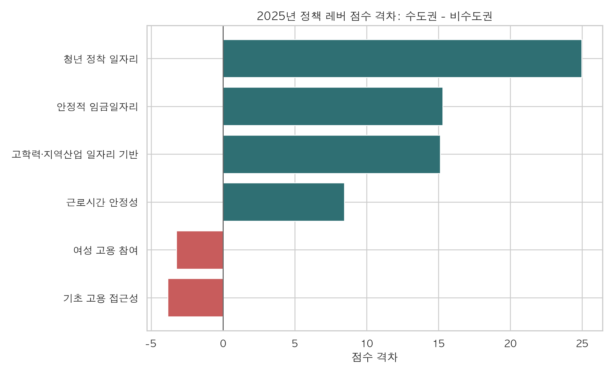

이 그래프는 수도권/비수도권 평균 차이 관점에서 어떤 정책 영역의 격차가 큰지 보여준다. 단, 최종 우선순위는 수도권 여부만이 아니라 17개 시도 전체의 상·하위 지역 격차를 함께 고려했다.

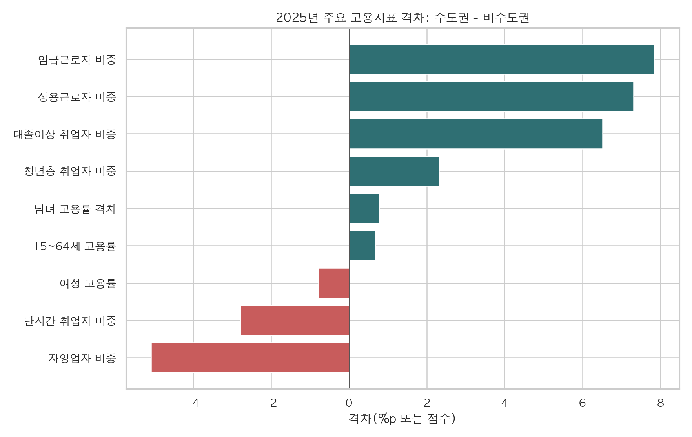

주요 지표를 직접 비교하면 어떤 원자료 지표가 정책 결론을 뒷받침하는지 확인할 수 있다.

## 8. 지역별 구조 진단

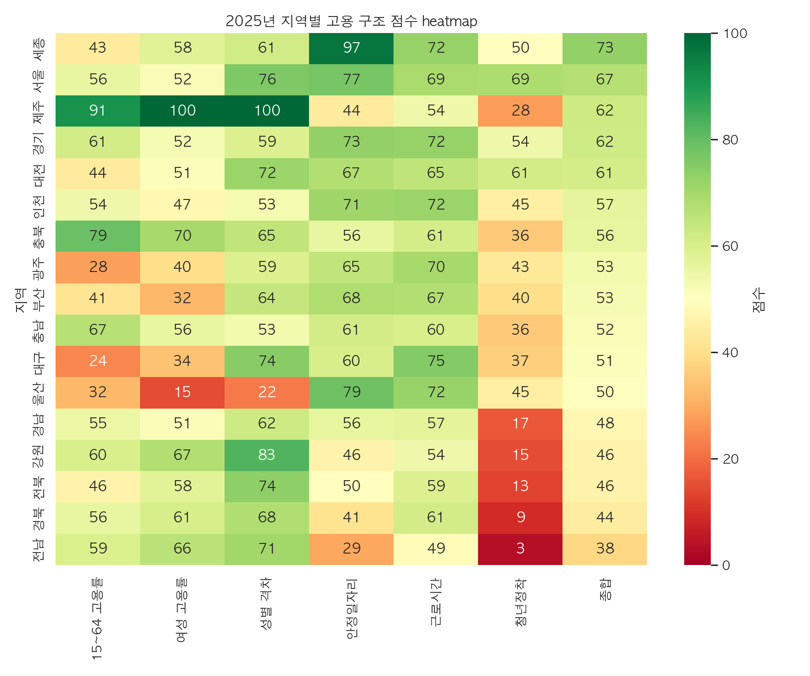

지역별 heatmap은 각 지역이 어떤 고용 구조에서 취약한지 보여준다. 같은 비수도권 안에서도 취약한 축이 다르기 때문에, 전국 단일 정책보다 지역 맞춤형 패키지가 필요하다.

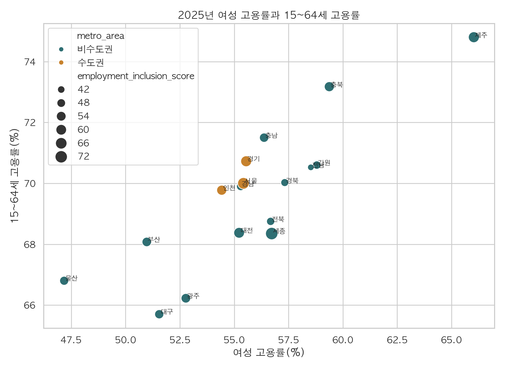

여성 고용률이 낮은 지역은 전체 핵심연령 고용률도 낮게 나타나는 경향이 있다. 이는 여성 고용 참여 확대가 지역 고용격차 완화의 중요한 축이 될 수 있음을 시사한다.

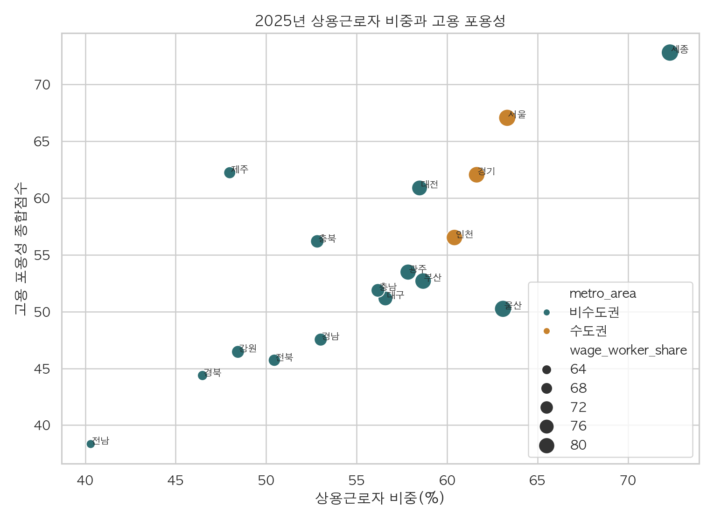

상용근로자 비중은 안정적 임금일자리 기반을 보여준다. 고용 포용성 점수가 낮은 지역은 안정적 임금일자리 기반을 같이 보강할 필요가 있다.

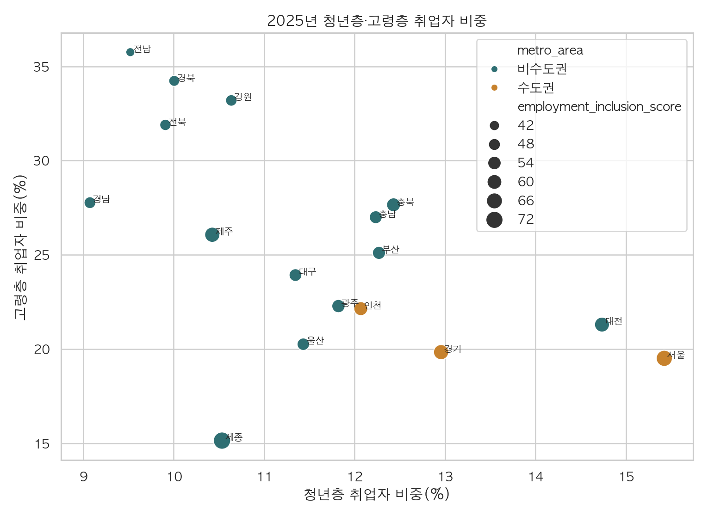

청년층과 고령층 취업자 비중은 지역의 인구·산업 구조를 반영한다. 청년층 취업자 비중이 낮고 고령층 비중이 높은 지역은 청년 정착형 일자리와 지역 산업 전환 정책이 필요하다.

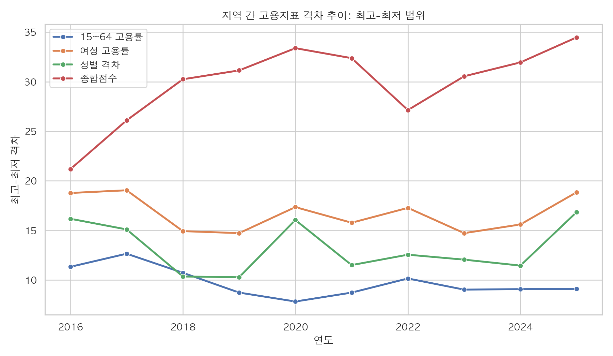

지역 간 격차가 일시적인지, 10년 동안 반복되는 구조인지 확인하기 위해 최고-최저 범위의 추이를 확인했다.

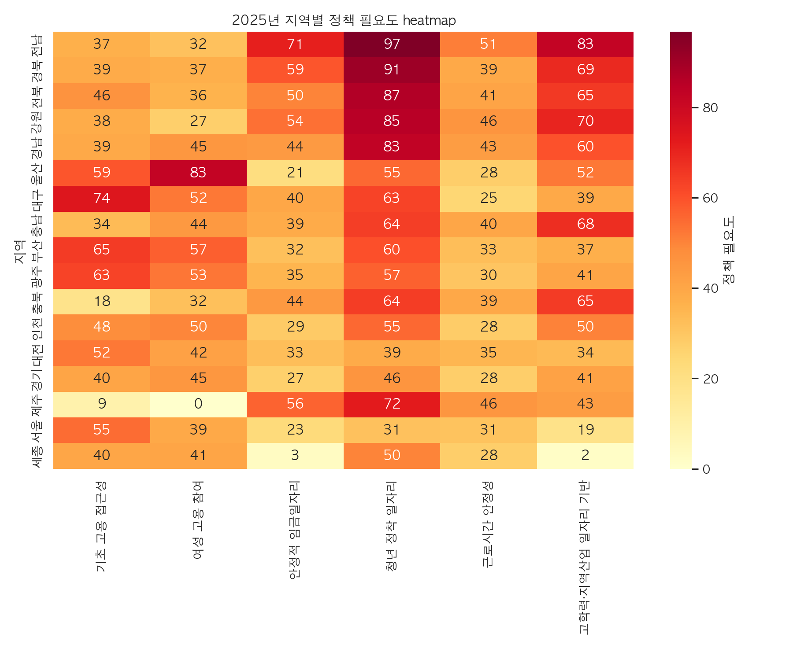

정책 필요도 heatmap은 지역별로 어떤 정책 패키지가 우선인지 보여준다.

## 9. 데이터 기반 정책 제안

### 1순위: 고학력·지역산업 일자리 기반

이 정책은 지역 간 고용 여건 차이를 줄이기 위한 최우선 축이다. 단순히 대학 진학률을 높이는 정책이 아니라, 비수도권 안에 대졸 이상 인력이 실제로 선택할 수 있는 산업과 직무를 만드는 정책이어야 한다.

구체적으로는 지역 전략산업, 공공서비스, 보건·돌봄, 디지털 전환, 제조 고도화, 연구개발, 지역 중견기업의 전문직무를 늘리고, 지역 대학과 기업의 채용 경로를 제도화하는 방식이 필요하다.

### 2순위: 청년 정착 일자리

청년 정착 일자리는 1순위 정책의 효과를 보완하는 역할을 한다. 청년층 취업자 비중이 낮고 고령층 취업자 비중이 높은 지역은 단기 채용 지원만으로는 구조가 바뀌기 어렵다. 지역에서 첫 직장, 경력 성장, 주거, 생활 인프라가 이어지는 패키지가 필요하다.

### 3순위: 안정적 임금일자리

안정적 임금일자리는 고학력·청년 일자리 정책이 지역에 남도록 만드는 기반이다. 새 일자리가 단기·불안정 일자리로 만들어지면 지역 정착 효과가 약하므로, 상용직 전환, 사회보험, 임금·복지 격차 완화가 같이 설계되어야 한다.

### 지역 맞춤형 실행 방향

- 고용률과 경제활동참가율이 낮은 지역: 직업훈련, 구직 매칭, 이동·주거 지원을 결합한 노동시장 진입 정책
- 여성 고용률과 성별 격차가 취약한 지역: 돌봄 인프라, 경력단절 복귀, 유연근무, 지역 여성 일자리 질 관리
- 안정일자리 점수가 낮은 지역: 상용직 채용 인센티브, 사회보험 가입 조건부 고용지원, 지역 중소기업 임금·복지 격차 완화
- 청년정착 점수가 낮은 지역: 지역 대학-기업 연계, 청년 주거와 일자리 패키지, 신산업·공공서비스 일자리 확대
- 근로시간 안정성이 낮은 지역: 비자발적 단시간 근로 실태조사, 시간제 근로자의 사회보험 사각지대 축소, 근로시간 선택권 강화

## 10. 최종 결론

2016~2025년 KOSIS 고용 데이터를 기준으로 보면, 지역 간 고용격차는 단순한 고용률 차이라기보다 고학력 인력이 일할 수 있는 지역 산업 기반, 청년 정착 가능성, 안정적 임금일자리 구조가 함께 만든 결과다. 이 중 이번 데이터에서 가장 우선순위가 높게 나온 정책 레버는 **고학력·지역산업 일자리 기반**이며, 다음으로 **청년 정착 일자리**, **안정적 임금일자리**이 중요하다.

따라서 지역 간 삶의 질 격차를 고용 측면에서 줄이려면 전국 공통의 단순 일자리 수 확대보다, 취약 지역의 핵심 병목을 겨냥한 `고학력·청년정착형 안정일자리 패키지`가 가장 타당하다. 특히 지역 대학-기업 연결, 전문직무 창출, 상용직 기반, 청년 주거·생활 지원을 한 번에 묶는 방향이 필요하다.

## 11. 주요 수치 요약

- 2025년 수도권 15~64세 고용률 평균: 70.2%
- 2025년 비수도권 15~64세 고용률 평균: 69.5%
- 2025년 수도권 여성 고용률 평균: 55.1%
- 2025년 비수도권 여성 고용률 평균: 55.9%
- 2025년 수도권 고용 포용성 종합점수 평균: 61.9
- 2025년 비수도권 고용 포용성 종합점수 평균: 52.4

## 12. 한계

- 이 분석은 KOSIS 고용 구조 데이터 기반 분석이며, 삶의 만족도 원자료를 직접 결합하지 않았다.
- 정책 효과를 실제로 추정한 인과분석은 아니므로, 결과는 정책 우선순위 가설로 해석해야 한다.
- 청년층·고령층 취업자 비중은 고용률이 아니라 취업자 구성비이므로 지역 인구구조의 영향을 받는다.
- 2026년은 1분기만 포함되어 최종 정책 결론에서는 제외했다.
